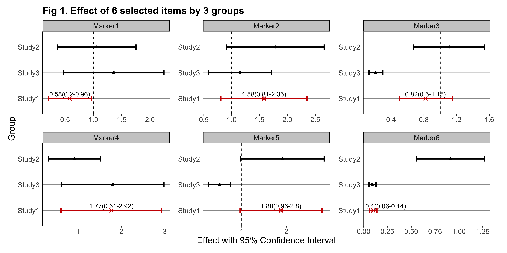

<!-- README.md is generated from README.Rmd. Please edit that file -->

```{r, include = FALSE}
knitr::opts_chunk$set(
  collapse = TRUE,
  comment = "#>",
  fig.path = "man/figures/README-",
  out.width = "100%"
)
```
# gwasforest

<!-- badges: start -->
<!-- badges: end -->

The goal of **gwasforest** is to extract and reform data from GWAS results, and then make a single integrated forest plot containing multiple windows of which each shows the result of individual SNPs (or other items of interest).

## Installation

The official release version of **gwasforest** can be installed from CRAN with:

```{r installation_release, eval = FALSE}
utils::install.packages("gwasforest")
```

The development version of **gwasforest** can be installed from GitHub with:

```{r installation_dev, eval = FALSE}
devtools::install_github("yilixu/gwasforest", ref = "main")
```

## Quick Demos

* **( 1 )** when **customFilename** (main input) is in dataframe format (with standardized column names): 
```{r example_01}
library(gwasforest)
set.seed(123)

# generate example data
tempValue = runif(n = 18, min = 0.01, max = 2)
tempStdErr = tempValue / rep(3:5, times = 6)
eg_customFilename = data.frame(paste0("Marker", 1:6), tempValue[1:6], tempStdErr[1:6], tempValue[7:12], tempStdErr[7:12], tempValue[13:18], tempStdErr[13:18], stringsAsFactors = FALSE)
colnames(eg_customFilename) = c("MarkerName", paste0(rep("Study", times = 6), rep(1:3, each = 2), rep(c("__Value", "__StdErr"), times = 3)))
rm(tempValue, tempStdErr)
```

```{r example_01_cont}
# run gwasforest function
eg_returnList = gwasforest(eg_customFilename, stdColnames = TRUE, valueFormat = "Effect", metaStudy = "Study1", colorMode = "duo")
```

* **( 2 )** when **customFilename** is in dataframe format (without standardized column names), while **customFilename_studyName** is provided in dataframe format: 
```{r example_02, eval = FALSE}
# generate example data
tempValue = runif(n = 18, min = 0.01, max = 2)
tempStdErr = tempValue / rep(3:5, times = 6)
eg_customFilename = data.frame(paste0("Marker", 1:6), tempValue[1:6], tempStdErr[1:6], tempValue[7:12], tempStdErr[7:12], tempValue[13:18], tempStdErr[13:18], stringsAsFactors = FALSE)
colnames(eg_customFilename) = c("MarkerName", paste0(rep("Study", times = 6), rep(1:3, each = 2), sample(LETTERS, 6)))
rm(tempValue, tempStdErr)
eg_customFilename_studyName = data.frame("studyName" = paste0("Study", 1:3), stringsAsFactors = FALSE)
```

```{r example_02_cont, eval = FALSE}
# run gwasforest function
eg_returnList = gwasforest(eg_customFilename, customFilename_studyName = eg_customFilename_studyName, stdColnames = FALSE, customColnames = c("Value", "StdErr"), valueFormat = "Effect", metaStudy = "Study1", colorMode = "duo")
```

* **( 3 )** when **customFilename_results** is in dataframe format (run either of the two steps above to see the example results): 
```{r example_03}
# extract results table
eg_customFilename_results = eg_returnList[[1]]
```

```{r example_plot, echo = TRUE, warning = TRUE}
library(ggplot2)

# render plot, see additional NOTES below
plot(eg_returnList[[2]])
```

* **( 4 ) NOTES**: As shown above, the plot rendered through plot() may suffer from certain issues such as low-resolution and overlapping labels. To overcome these issues and get the genuine plot output from **gwasforest**, it is recommended to provide a valid **outputFolderPath** so that a better-rendered plot can be created. The below is the genuine plot output created from the same example data:


